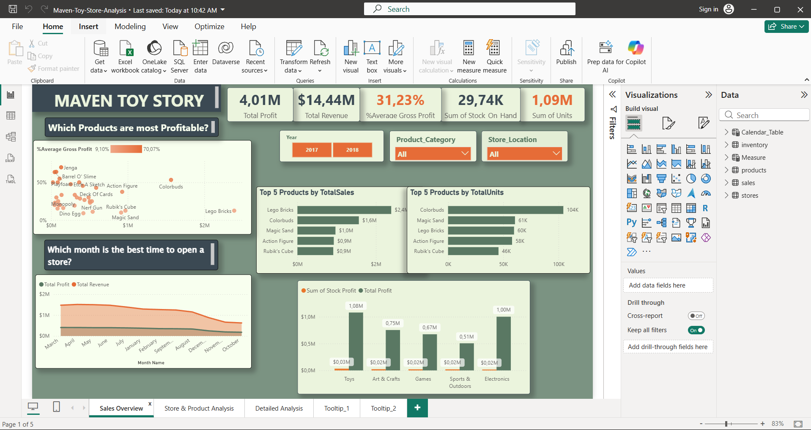
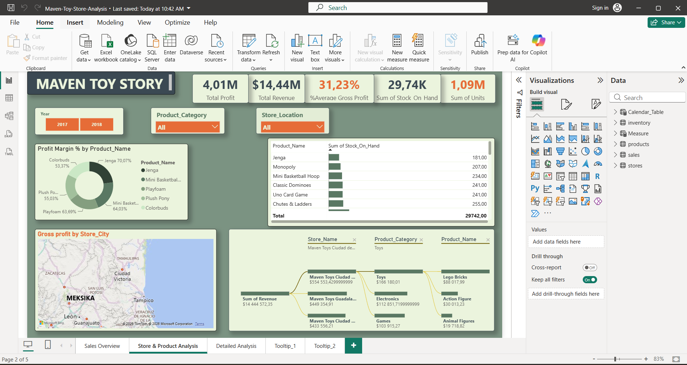
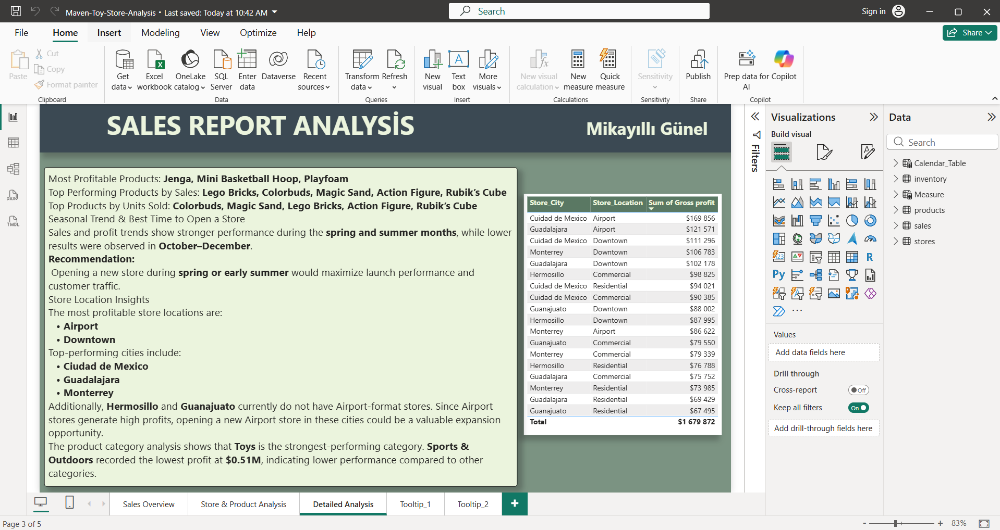

# 🧸 Maven Toy Store Sales Analysis | Power BI

## 📌 Project Overview

This project presents an interactive **Power BI dashboard** created to analyze the sales performance of Maven Toy Store.

The goal of the analysis is to understand:

- Overall sales and profitability
- Product performance
- Store performance
- Inventory levels
- Seasonal sales trends
- Potential store expansion opportunities

The dashboard transforms raw business data into clear and actionable insights that can support data-driven decision-making.

---

## 🛠️ Tools Used

- Power BI
- Power Query
- DAX
- Data Modeling
- Data Visualization
- Business Intelligence

---

## 📊 Key Performance Indicators

| KPI | Result |
|---|---:|
| Total Revenue | $14.44M |
| Total Profit | $4.01M |
| Average Gross Profit Margin | 31.23% |
| Units Sold | 1.09M |
| Stock on Hand | 29.74K |

---

# 📈 Dashboard

## 1. Sales Overview

The Sales Overview page provides a high-level view of overall business performance.

It includes:

- Total Revenue
- Total Profit
- Average Gross Profit Margin
- Total Units Sold
- Stock on Hand
- Top 5 Products by Sales
- Top 5 Products by Units Sold
- Product Profitability
- Monthly Revenue and Profit Trends
- Product Category Performance
- Interactive filters by Year, Product Category and Store Location



---

## 2. Store & Product Analysis

This page provides a deeper analysis of store and product performance.

It includes:

- Profit Margin by Product
- Stock on Hand by Product
- Gross Profit by Store City
- Revenue Breakdown by Store
- Product Category Analysis
- Geographic Analysis
- Decomposition Tree
- Interactive Filters



---

## 3. Detailed Analysis

The Detailed Analysis page summarizes the main findings and business recommendations generated from the dashboard.



---

# 🔎 Key Insights

## 🏆 Product Performance

The most profitable products include:

- Jenga
- Mini Basketball Hoop
- Playfoam

The highest-performing products by total sales include:

- Lego Bricks
- Colorbuds
- Magic Sand
- Action Figure
- Rubik's Cube

**Lego Bricks** generated approximately **$2.4M in sales**, making it the highest-selling product.

---

## 📦 Units Sold

The products with the highest number of units sold include:

- Colorbuds — approximately 104K units
- Magic Sand — approximately 61K units
- Lego Bricks — approximately 60K units
- Action Figure — approximately 58K units
- Rubik's Cube — approximately 46K units

---

## 🏪 Store Performance

The analysis shows that the strongest-performing store location types include:

- Airport
- Downtown

Some of the top-performing cities are:

- Ciudad de Mexico
- Guadalajara
- Monterrey

---

## 📅 Seasonal Trends

Sales and profit performance is stronger during the **spring and summer months**.

Lower performance was observed toward **October–December**.

Based on these trends, opening a new store during **spring or early summer** may provide a stronger launch period.

---

## 🌍 Expansion Opportunities

The analysis identified potential expansion opportunities in:

- Hermosillo
- Guanajuato

These cities currently do not have Airport-format stores.

Since Airport locations demonstrate strong profitability, introducing this type of store in these cities may represent a potential business opportunity.

---

## 🧸 Product Category Performance

The **Toys** category is the strongest-performing product category.

The **Sports & Outdoors** category generated the lowest profit at approximately **$0.51M**, indicating an opportunity for further investigation and optimization.

---

# 💡 Business Recommendations

Based on the analysis:

1. Prioritize high-performing products such as Lego Bricks, Colorbuds, Jenga and Mini Basketball Hoop.

2. Maintain sufficient inventory levels for products with high sales volume.

3. Investigate the performance of the Sports & Outdoors category and identify opportunities to improve profitability.

4. Consider spring or early summer when planning new store openings.

5. Explore opportunities to introduce Airport-format stores in Hermosillo and Guanajuato.

6. Monitor both product profitability and sales volume when making inventory and product decisions.

---

# 🗂️ Data Model

The Power BI model includes data related to:

- Sales
- Products
- Stores
- Inventory
- Calendar

A separate Measure table was also used to organize calculated metrics and KPIs.

---

# ⚙️ Power BI Features Used

- Data Cleaning
- Power Query
- Data Modeling
- DAX Measures
- KPI Cards
- Bar Charts
- Line Charts
- Donut Charts
- Maps
- Decomposition Tree
- Tables
- Slicers
- Tooltips
- Interactive Filtering

---

# 📁 Repository Structure

```text
maven-toy-store-power-bi/
│
├── Maven-Toy-Store-Analysis.pbix
├── README.md
│
└── images/
    ├── sales-overview.png
    ├── store-product-analysis.png
    └── detailed-analysis.png
